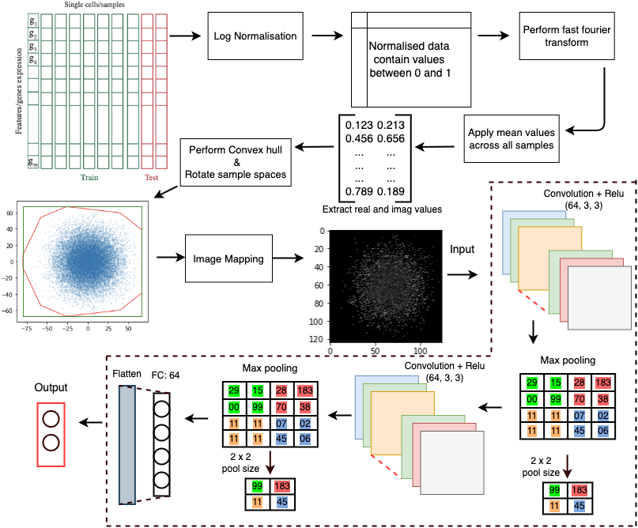

# Fast Fourier Transform(FFT)-nonImageData to Image

##Introduction

This repository contains a python implementation of Fast Fourier Transformation(FFT) algorithm that converts non-image data into images. The FFT method has been used in a project: **Omics Imagification: Transforming High-throughout Molecular Representation of a Cell into an Image**.



Each folder indicates a specific dataset in the experiment. In these folders, various normalisation and classifciation methods were conducted. The name of each .**ipynb** file should indicate the dataset, normalstion and classficaition used. 

##Dataset

Specification of dataset used in the experiment are listed.


##Usage

```python
import numpy as np
import pandas as pd
from scipy.spatial import ConvexHull
from numpy.fft import fft
from numpy.fft import fftshift

#1. Get x_train, x_test, y_train, y_test from selected dataset

#2. Normalisation
ln = LogScaler()
x_train_norm = ln.fit_transform(x_train)
x_test_norm = ln.transform(x_test)

#3. FFT fit
it = FftTransformer(pixels=124)
_ = it.fit(x_train_norm, plot=True)

#4. FFT transform 
x_train_img = it.transform(x_train_norm)
x_test_img = it.transform(x_test_norm)
```

## Sample Transformed Images


## Sample Confusion Matrices


