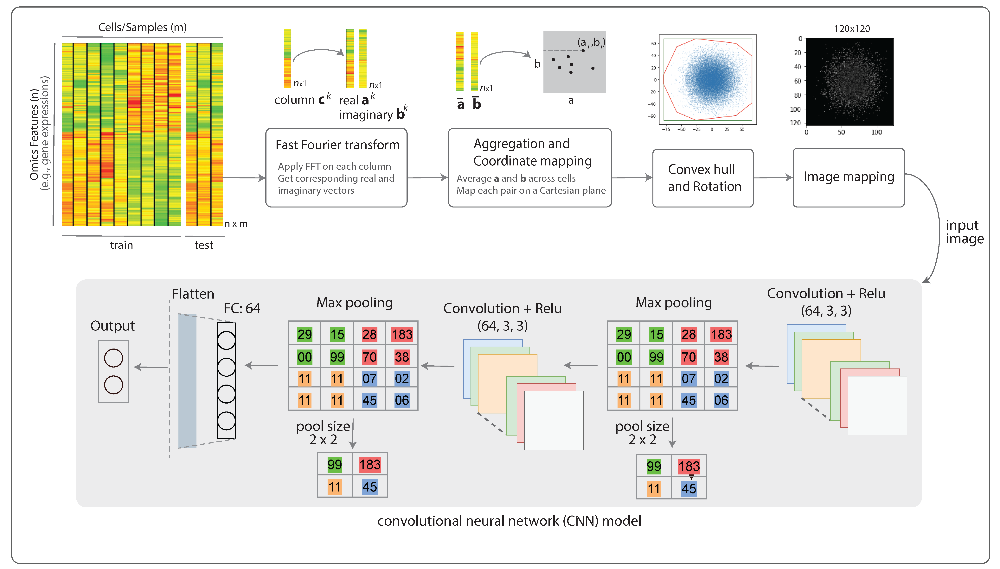
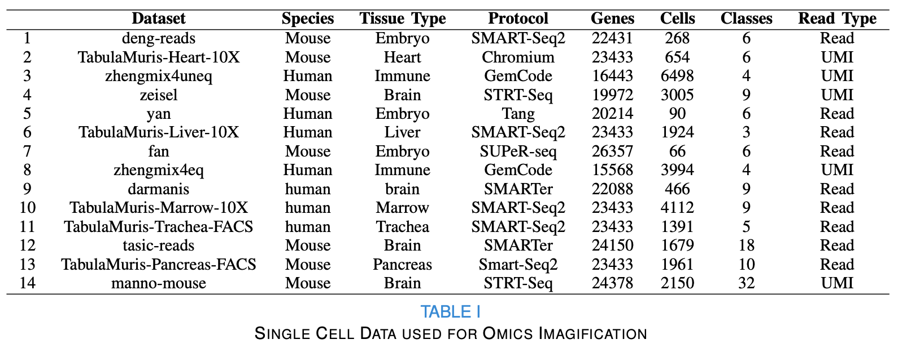
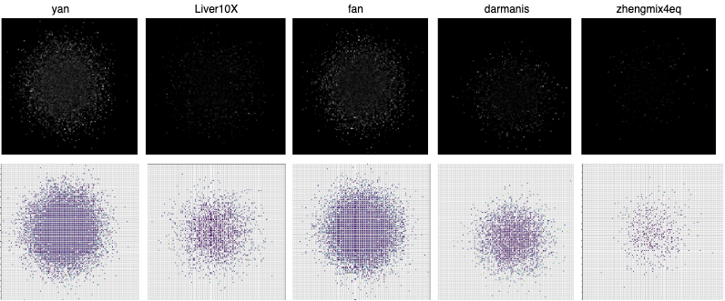
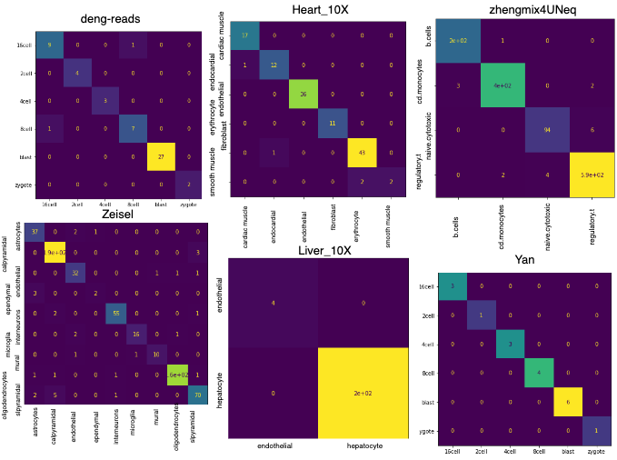

# Fotomics: Fourier transform-based omics imagification for deep learning-based cell-identity mapping using single-cell omics profiles

## Introduction

This repository contains a python implementation of Fotomics algorithm that converts non-image data into images. \
Different omics profiles, depending on the underlying technology, encompass measurements of several hundred to several thousand molecules in a biological sample or a cell. This study develops upon the concept of “omics imagification” as a process of transforming a vector representing these numerical measurements into an image with a one-to-one relationship with the corresponding sample. The proposed imagification process transforms a high-dimensional vector of molecular measurements into a two-dimensional RGB image to enable holistic molecular representation of a biological sample and to improve the classification of different biological phenotypes using automated image recognition methods in computer vision. A transformed image represents 2D coordinates of molecules in a neighbour-embedded space representing molecular abundance and gene intensity. The proposed method was applied to single-cell RNA sequencing (scRNA-seq) data to “imagify” gene expression profiles of individual cells. Our results show that a simple convolutional neural network trained on single-cell transcriptomics images accurately classifies diverse cell types outperforming the best-performing scRNA-seq classifiers such as Support Vector Machine and Random Forrest. 



Each folder indicates a specific dataset in the experiment. In these folders, various normalisation and classifciation methods were conducted. The name of each .**ipynb** file should indicate the dataset, normalstion and classficaition used. 

## Dataset

Specification of dataset used in the experiment are listed.



## Usage

```python
from Fotomics import LogScaler,FftTransformer

import numpy as np
import pandas as pd
from scipy.spatial import ConvexHull
from numpy.fft import fft
from numpy.fft import fftshift

#1. Get x_train, x_test, y_train, y_test from selected dataset

#2. Normalisation
ln = LogScaler()
x_train_norm = ln.fit_transform(x_train)
x_test_norm = ln.transform(x_test)

#3. FFT fit
it = FftTransformer(pixels=124)
_ = it.fit(x_train_norm, plot=True)

#4. FFT transform 
x_train_img = it.transform(x_train_norm)
x_test_img = it.transform(x_test_norm)
```

## Sample Transformed Images



## Sample Confusion Matrices



## Demo

**deng_reads_demo.ipynb** is an example of Fotomics in action. We used the **deng_reads** dataset with 21287 features. 

1. Import packages from Fotomics
2. Read **deng_raeds** dataset (*deng-reads-RawCount-modefied.csv*) 
3. Data preprocessing and data split
4. Shuffle dataset by rows and columns
5. Get labels of dataset
6. Split data into training set and test set
7. Use **LogScaler** to preprocess the data and use **FftTransformer** to convert data points into images of 124 pixels
8. Display converted images 
9. Train image data on CNN model
10. Calculate accuracy and F1 score